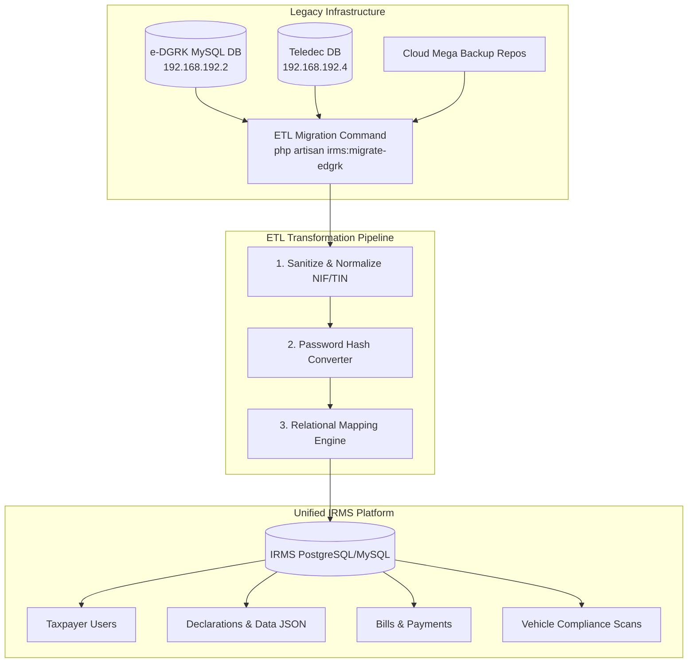

# Comprehensive Migration Plan & Server Access Guide: Legacy e-DGRK & Teledec to IRMS

This document provides an exhaustive, step-by-step guide for securing access to legacy e-DGRK and Teledec infrastructure based on the handover document (`Remise_Reprise_DGRK.pdf`), followed by an end-to-end technical ETL data migration plan into the unified **IRMS** platform.

---

## Part 1: Step-by-Step Infrastructure & Server Access Guide

### 1. Network & VPN Access Setup
Before accessing remote desktop instances or database ports, establish connection to the private DGRK ZeroTier overlay network.

1. **Install ZeroTier Client**: Download and install ZeroTier One on the migration workstation.
2. **Authenticate & Join Network**:
   - Access ZeroTier Console: [https://my.zerotier.com](https://my.zerotier.com)
   - Account Email: `empako2016@gmail.com`
   - Retrieve the active DGRK Network ID from the network dashboard and authorize your migration workstation IP.

---

### 2. AWS Cloud Console Access & Cloudflare DNS Control
1. **e-DGRK Main Cloud Infrastructure (AWS)**:
   - Console URL: [https://aws.amazon.com/fr/](https://aws.amazon.com/fr/)
   - Account Login: `empako2016@gmail.com`
   - *Requirement*: Obtain initial 2FA seed or hardware sync from the outgoing DGRK IT administrator for Google Authenticator.
2. **Teledec Cloud Infrastructure (AWS)**:
   - Console URL: [https://aws.amazon.com/fr/](https://aws.amazon.com/fr/)
   - Account Login: `3cxekinet@gmail.com`
3. **Cloudflare Edge Control**:
   - Dashboard URL: [https://dash.cloudflare.com/login](https://dash.cloudflare.com/login)
   - Account Login: `empako2016@gmail.com`
   - *Purpose*: Modify DNS A/CNAME records (`edgrk.e-dgrk.com`, `edec.e-dgrk.com`, `dgrk.gouv.cd`) during final cutover.

---

### 3. Server Remote Desktop & Direct Database Connections

#### A. Main e-DGRK Application & Database Server
- **RDP Target (via ZeroTier VPN)**: `192.168.192.2:5555`
- **RDP User**: `hautsommet`
- **Database Engine**: Local MySQL Server instance
- **MySQL User**: `sommetdgrk`
- **Extraction Command**:
  ```bash
  mysqldump -u sommetdgrk -p --single-transaction --quick --routines --triggers edgrk_db > /backups/edgrk_full_legacy_dump.sql
  ```

#### B. Teledec Tele-Declaration Server
- **RDP Target (via ZeroTier VPN)**: `192.168.192.4`
- **RDP User**: `Administrator`
- **Extraction Targets**:
  - Tele-declaration database: `https://edec.e-dgrk.com/`
  - Embarkation statistics database: `https://edec.e-dgrk.com/mydash_tse/`

#### C. Local eDGRK Secondary Instance
- **RDP Target (via ZeroTier VPN)**: `169.239.74.2`
- **RDP User**: `Administrateur`

---

## Part 2: Schema Mapping & ETL Migration Architecture



---

### Entity Mapping Matrix

| Legacy Entity (e-DGRK / Teledec) | IRMS Target Entity | Field Mapping & Transformations |
| :--- | :--- | :--- |
| `contribuable` / `users` | `users` | `id_nif` ➔ `nif` / `taxpayer_number`<br>`nom` + `prenom` ➔ `first_name` + `last_name`<br>`raisosociale` ➔ `company_name`<br>`type` ('physique'/'morale') ➔ `taxpayer_type`<br>`motdepasse` ➔ Wrapped password re-hash |
| `declaration` / `tele_declaration` | `declarations` & `declaration_data` | `ref_declaration` ➔ `reference_number`<br>`annee_fiscale` ➔ `fiscal_year`<br>`statut` ➔ `status` ('pending', 'validated', 'paid')<br>Tax form inputs ➔ `declaration_data` (JSONB) |
| `factures` / `avis_imposition` | `bills` | `num_facture` ➔ `reference_number`<br>`montant_du` ➔ `amount`<br>`montant_penalite` ➔ `penalty`<br>`statut_paiement` ➔ `status` |
| `quittances` / `paiements` | `payments` | `num_quittance` ➔ `receipt_number`<br>`mode_paiement` ➔ `payment_method` (bank / mobile_money)<br>`date_paiement` ➔ `payment_date` |
| `vehicules` / `vignettes` | `compliance_scans` & `declarations` | `plaque_immatriculation` ➔ `license_plate`<br>`num_chassis` ➔ `declaration_data->chassis_number`<br>`annee_vignette` ➔ `fiscal_year` |

---

## Part 3: Phased Migration Plan & Timeline (25 Days)

```
Gantt Schedule:
[Phase 1: Access & Audit]        Days 1-3   ■■■
[Phase 2: Extraction & Clean]    Days 4-7   ■■■■
[Phase 3: ETL Command Engine]    Days 8-14  ■■■■■■■
[Phase 4: Dry-Run & Staging]     Days 15-18 ■■■■
[Phase 5: Cutover & Switch]      Days 19-21 ■■■
[Phase 6: Post-Audit & Decom]    Days 22-25 ■■■■
```

### Phase 1: Environment Provisioning & Access Verification (Days 1–3)
- Connect to ZeroTier VPN overlay.
- Verify RDP access to `192.168.192.2:5555`, `192.168.192.4`, and `169.239.74.2`.
- Export baseline database schemas and record total row counts for taxpayers, declarations, bills, and payments.

### Phase 2: Database Extraction, Anonymization & Data Cleaning (Days 4–7)
- Execute complete `mysqldump` exports from e-DGRK and Teledec servers.
- Sanitize invalid NIF/TIN formats, trim trailing whitespace, fix corrupt date timestamps, and normalize phone numbers to E.164 format (+243...).
- Import staging SQL dumps into the IRMS migration pipeline environment.

### Phase 3: Custom ETL Artisan Command Construction (Days 8–14)
- Develop `App\Console\Commands\MigrateEdgrkData.php` in IRMS.
- Implement chunked DB streaming (`DB::table(...)->chunk(1000)`) to prevent RAM exhaustion.
- Build legacy password fallback authentication handler in IRMS (`LegacyPasswordHasher`) to seamlessly upgrade legacy PHP MD5/SHA1 hashes to Bcrypt upon user login.
- Map complex legacy declaration fields into IRMS flexible JSON schema (`declaration_data`).

### Phase 4: Dry-Run Testing & Integrity Auditing (Days 15–18)
- Execute full migration dry-run on IRMS Staging environment.
- Run financial reconciliation audits comparing legacy total collection sums vs. migrated IRMS `bills` and `payments`.
- Verify taxpayer PIN certificate generation and vehicle compliance search parity on migrated records.

### Phase 5: Final Production Cutover & DNS Transition (Days 19–21)
- Place legacy e-DGRK and Teledec web applications in **Read-Only / Maintenance Mode**.
- Perform delta database extraction for transactions recorded during the migration window.
- Execute final IRMS production migration command.
- Update Cloudflare DNS records to route `edgrk.e-dgrk.com` and `edec.e-dgrk.com` to the new IRMS infrastructure.

### Phase 6: Post-Cutover Auditing & Decommissioning (Days 22–25)
- Monitor real-time taxpayer login activation and mobile money payment webhooks.
- Archive legacy full MySQL database dumps onto secure Cloud Mega backup repositories.
- Safely decommission legacy cloud instances while retaining cloud backup snapshots.

---

## Part 4: Critical Risk Management & Contingency Matrix

| Risk Factor | Impact Level | Mitigation Strategy |
| :--- | :--- | :--- |
| **Google Authenticator 2FA Barrier** | HIGH | Schedule a live handover session with outgoing DGRK IT to transfer/re-key 2FA seeds for AWS, ZeroTier, and Mega Cloud. |
| **Legacy Password Hash Incompatibility** | MEDIUM | Implement a custom Guard/Hasher in Laravel that validates legacy hashes (MD5/SHA1) on first login and automatically re-hashes credentials to Bcrypt. |
| **Duplicate NIF/TIN or Plate Records** | MEDIUM | Enforce unique constraint resolution rules in the ETL script (`ON DUPLICATE KEY UPDATE` / deduplication mapping table). |
| **Cutover Downtime Spillover** | HIGH | Perform pre-migrated batch historical loads for 2020-2025 data prior to cutover day, leaving only the final delta run (< 1 hour downtime). |
| **Data Discrepancy / Financial Variance** | CRITICAL | Implement automated pre- and post-migration financial validation checks comparing total `SUM(montant)` before declaring cutover complete. |
